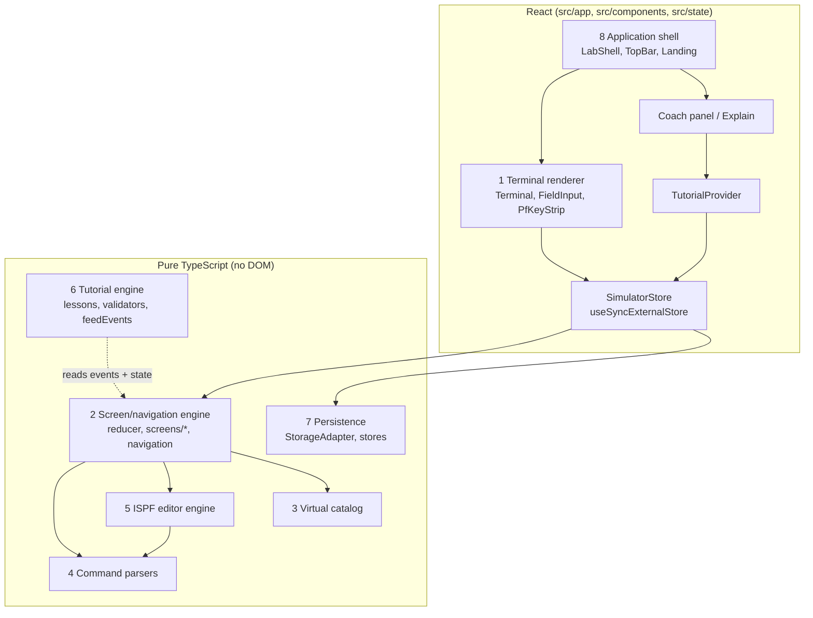

# Architecture

Eight conceptual layers, each a folder under `src/`. Arrows point in the direction of imports; nothing below the
line imports React.

## 1. Terminal renderer (`src/components/terminal`)

`Terminal.tsx` receives a `RenderedScreen` (rows of `text` / `field` segments) from the engine and draws 24 rows of
80 columns in `ch` units. Typed values live in local React state (drafts) and are sent **only** on Enter or a PF key
— the 3270 model. Keyboard: Enter, Tab/Shift+Tab (field order from `screen.fields`), F1–F12, Insert, arrow keys
between editor records. `PfKeyStrip` buttons call the same `store.pf(key, drafts)`.

## 2. Screen / navigation engine (`src/engine`)

`reduce(state, action) → { state, events }` is pure. `registry.ts` maps `ScreenId` → `ScreenHandler`
(`render`, `onEnter`, `onPf`, `help`). `navigation.ts` owns the panel stack and option-path resolution.
Every meaningful outcome is a `SimEvent` (`SCREEN_OPENED`, `DATASET_SEARCHED`, `MEMBER_SAVED`, …). Messages are
ISPF-style short/long pairs in `state.message`.

State shape: see `src/engine/types.ts` (`SimulatorState`). `fieldValues` keeps typed drafts so a panel can be
redisplayed with the user's text after an error; `focusField` tells the renderer where the cursor goes.

## 3. Virtual catalog (`src/catalog`)

Immutable `Catalog` keyed by data-set name; every mutation returns `{ catalog, error? }` with an ISPF message so
screens never throw. `buildSeed(hlq)` templates the training data on the logon userid.

## 4. Command parsers (`src/parsers`)

Pure functions returning discriminated unions. The engine and editor never inspect raw strings.

## 5. ISPF editor engine (`src/editor`)

`EditorSession` uses stable line ids so line commands survive inserts/deletes. `applyLineCommands` resolves one
Enter press (pending + typed) and reports incomplete/invalid commands; `applyPrimaryCommand` handles the command
line and returns *effects* (save/cancel/end/create/copy) for the screen layer, which owns the catalog.

## 6. Tutorial engine (`src/tutorial`)

Declarative `Lesson` objects with `Validator(ctx: { event?, state, hlq })`. `feedEvents` is fed the event batch of
each Enter/PF plus the resulting state; consecutive steps may pass in one batch. It never touches the DOM or the
simulator; the provider dispatches `GOTO` / `LOAD_CATALOG` for a lesson's `startingState`.

## 7. Persistence (`src/persistence`)

`StorageAdapter` interface; `LocalStorageAdapter` in the browser, `MemoryAdapter` for SSR/tests. Keys:
`ispf-lab:catalog:v1:<USERID>`, `ispf-lab:progress:v1`, `ispf-lab:settings:v1`, `ispf-lab:last-userid:v1`,
`ispf-lab:mode:v1`, `ispf-lab:current-lesson:v1`. Catalog saves are debounced (150 ms) and flushed on unload.
A backend later replaces the adapter; the engine does not change.

## 8. Application shell (`src/app`, `src/components/shell`, `src/state`)

`SimulatorStore` (framework-free) wraps the reducer, persists, and fans events to listeners. React reads it through
`useSyncExternalStore`. `TutorialProvider` subscribes to events. `DesktopGate` renders nothing during SSR and gates
`/lab/*` to wide, fine-pointer viewports, which also lets providers read browser storage in initializers safely.

Routes: `/` landing, `/lab` simulator, `/lab/progress`, `/resources`.

## Data flow for one Enter press in the editor

1. `Terminal` collects drafts → `store.enter(fields)`.
2. `reduce` → `editorScreen.onEnter`: `applyTextEdits` → `applyLineCommands` → scroll field → `applyPrimaryCommand`
   → effect (e.g. save → `saveRecords` on the catalog) → new state + events (`EDITOR_LINE_INSERTED`, `MEMBER_SAVED`…).
3. Store persists the catalog (debounced), bumps version, notifies React and the tutorial listener.
4. `TutorialProvider.feedEvents` advances the lesson; `LearningPanel` re-renders.
